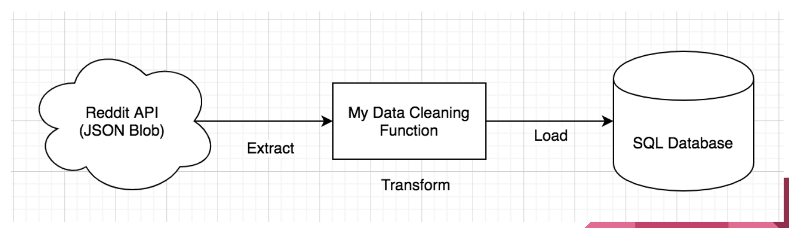
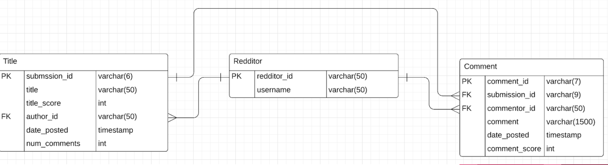
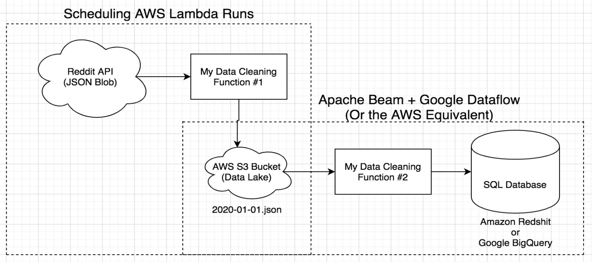

# reddit_pipeline
A data engineering pipeline to extract information from reddit.

## Workflow
1. Pull data from reddit using praw (json object)
2. Clean data and only keep relevant information
3. Load data into a mySQL relational database

## Data Model

## Improved Data Pipeline: Dealing with Big Data
When it comes to big data, we must redesign our pipeline to account for the massive amount of memory and data processing requirements. Therefore, I propose a new and improved pipeline that contains a 2-step ETL pipeline which first dumps raw data into a data lake. The second step then takes the data lake data and processes it, using some distributed environment tools such as Apache Beam and Google Dataflow. The database also needs to be upgraded to a distributed data warehouse such as Amazon Redshift or Google Bigquery.

